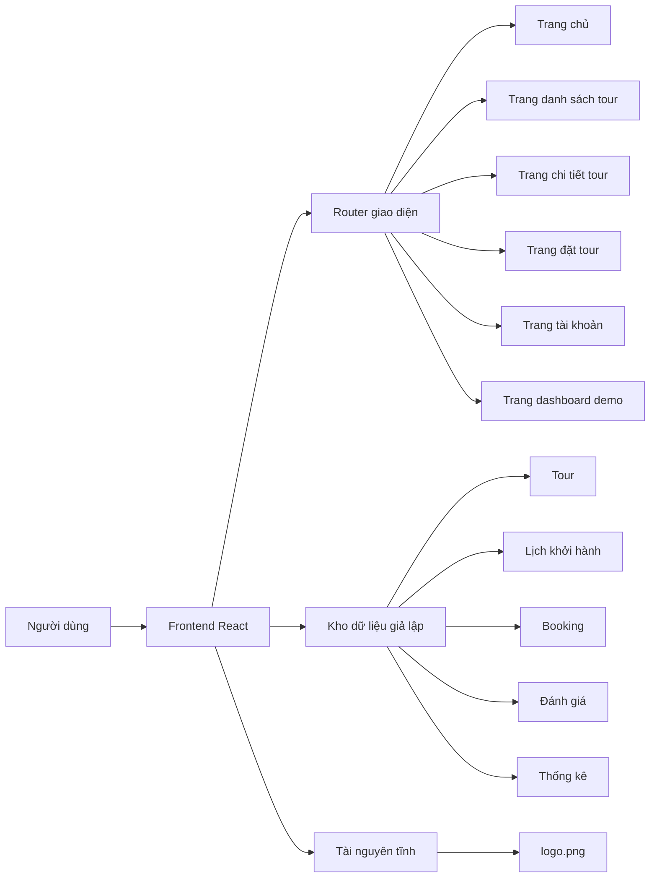

## 1. Thiết kế kiến trúc



## 2. Mô tả công nghệ
- Frontend: React 18 + TypeScript + Vite
- Tạo style: Tailwind CSS 3
- Điều hướng: React Router DOM
- Dữ liệu demo: mock data cục bộ trong frontend
- Biểu tượng: Lucide React hoặc thư viện icon nhẹ tương đương
- Ảnh thương hiệu: dùng file `logo.png` trong thư mục gốc dự án
- Backend: chưa cần cho bản demo
- Cơ sở dữ liệu: chưa cần, mô phỏng bằng dữ liệu tĩnh

## 3. Định nghĩa route
| Route | Mục đích |
|-------|---------|
| / | Trang chủ giới thiệu thương hiệu và tour nổi bật |
| /tours | Trang danh sách tour có bộ lọc |
| /tours/:slug | Trang chi tiết tour |
| /booking | Trang đặt tour demo |
| /account | Trang tài khoản khách hàng |
| /staff | Trang dashboard nội bộ demo |

## 4. Định nghĩa dữ liệu frontend
```ts
type Tour = {
  id: string;
  slug: string;
  name: string;
  location: string;
  duration: string;
  price: number;
  rating: number;
  cover: string;
  tags: string[];
  summary: string;
};

type Departure = {
  id: string;
  tourId: string;
  date: string;
  seatsLeft: number;
  status: "Open" | "Full" | "Closed";
};

type Booking = {
  id: string;
  customerName: string;
  tourName: string;
  departureDate: string;
  travelers: number;
  total: number;
  status: "Pending Payment" | "Confirmed" | "Completed" | "Cancelled";
};
```

## 5. Cấu trúc thư mục đề xuất
```text
src/
  assets/
    logo.png
  components/
    layout/
    sections/
    ui/
  data/
    tours.ts
    departures.ts
    bookings.ts
  pages/
    HomePage.tsx
    ToursPage.tsx
    TourDetailPage.tsx
    BookingPage.tsx
    AccountPage.tsx
    StaffDashboardPage.tsx
  styles/
    theme.css
  App.tsx
  main.tsx
```

## 6. Quy ước giao diện và triển khai
- Sử dụng biến màu tập trung trong `theme.css` để cố định palette xanh dương và cam
- Tạo layout nhất quán giữa các trang con: header, navigation, nút CTA, thẻ card, badge trạng thái
- Dùng animation vừa phải ở hero, card hover, chuyển route và khối số liệu để bản demo sống động nhưng vẫn gọn
- Tối ưu cho phần trình bày đồ án: dữ liệu mẫu giàu ngữ cảnh, giao diện sạch, section dễ chụp màn hình
- Dùng logo thật ở header, hero và footer để tạo sự đồng bộ nhận diện thương hiệu
