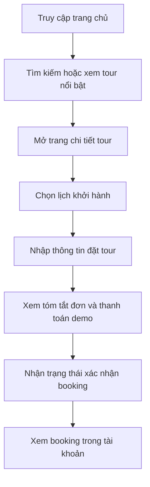

## 1. Tổng quan sản phẩm
Demo này mô phỏng một hệ thống đặt tour du lịch cho công ty VietNamExplorer, tập trung vào trải nghiệm giới thiệu tour, tìm kiếm, xem lịch khởi hành và đặt tour trực tuyến.
- Mục tiêu chính là tạo một giao diện web hiện đại, dễ thuyết trình, thể hiện rõ quy trình đặt tour của doanh nghiệp du lịch riêng.
- Giá trị mang lại là có một bản demo trực quan để dùng cho báo cáo môn học, trình bày đồ án và làm nền cho việc phát triển hệ thống thật.

## 2. Tính năng cốt lõi

### 2.1 Vai trò người dùng
| Vai trò | Cách truy cập | Quyền chính |
|------|----------------|-------------|
| Khách truy cập | Vào website trực tiếp | Xem tour, tìm kiếm, xem chi tiết tour, xem đánh giá |
| Khách hàng | Đăng nhập tài khoản | Đặt tour, xem booking, xem hóa đơn, quản lý tài khoản |
| Nhân viên | Tài khoản nội bộ | Xem booking mới, xác nhận booking, quản lý tour và lịch khởi hành |
| Quản trị viên | Tài khoản quản trị | Quản lý nội dung, phân quyền, dashboard tổng quan |

### 2.2 Module chức năng
1. **Trang chủ**: hero banner, logo công ty, giới thiệu thương hiệu, tour nổi bật, lý do chọn công ty, CTA đặt tour
2. **Trang danh sách tour**: tìm kiếm, lọc theo điểm đến, thời lượng, giá, ngày khởi hành, hiển thị tour dạng card
3. **Trang chi tiết tour**: gallery ảnh, lịch trình, bảng giá, lịch khởi hành, chính sách hủy, đánh giá, nút đặt tour
4. **Trang đặt tour**: nhập thông tin liên hệ, số lượng khách, danh sách người tham gia, áp dụng voucher, tóm tắt đơn
5. **Trang tài khoản khách hàng**: hồ sơ cá nhân, booking gần đây, lịch sử thanh toán, hóa đơn, tour yêu thích
6. **Trang dashboard nội bộ demo**: thẻ thống kê nhanh, booking mới, lịch khởi hành sắp tới, doanh thu minh họa

### 2.3 Chi tiết trang
| Tên trang | Module | Mô tả chức năng |
|-----------|--------|-----------------|
| Trang chủ | Hero thương hiệu | Dùng logo trong thư mục, tiêu đề lớn, giới thiệu dịch vụ, nút khám phá tour |
| Trang chủ | Tour nổi bật | Hiển thị tour dạng grid, có badge khuyến mãi và nút xem nhanh |
| Trang chủ | Quy trình đặt tour | Minh họa các bước tìm tour, chọn lịch, thanh toán, xác nhận |
| Danh sách tour | Bộ lọc | Lọc theo điểm đến, giá, số ngày, phương tiện, khởi hành |
| Danh sách tour | Danh sách card | Mỗi tour có ảnh, tên, giá, số ngày, số chỗ còn lại, CTA đặt ngay |
| Chi tiết tour | Thông tin tour | Hiển thị lịch trình, điểm nổi bật, dịch vụ bao gồm, chính sách |
| Chi tiết tour | Lịch khởi hành | Bảng lịch, số chỗ còn, trạng thái mở bán, chọn lịch |
| Đặt tour | Biểu mẫu booking | Thu thập thông tin người đặt, người tham gia, voucher, ghi chú |
| Tài khoản khách hàng | Quản lý đơn | Danh sách booking, trạng thái, nút xem hóa đơn |
| Dashboard nội bộ | Thống kê | Booking mới, tour hôm nay, khách hôm nay, doanh thu minh họa |

## 3. Luồng sử dụng chính
Người dùng truy cập trang chủ, xem tour nổi bật hoặc dùng bộ lọc để tìm tour phù hợp. Sau khi mở trang chi tiết, người dùng chọn lịch khởi hành, kiểm tra giá và số chỗ còn lại, rồi chuyển sang màn hình đặt tour để nhập thông tin và xem tóm tắt đơn hàng. Với bản demo, trạng thái thanh toán và xác nhận booking được mô phỏng bằng dữ liệu mẫu để thể hiện đầy đủ trải nghiệm hệ thống.

## 4. Thiết kế giao diện
### 4.1 Phong cách thiết kế
- Màu chủ đạo: xanh dương đậm và xanh dương sáng để gợi cảm giác tin cậy, an toàn và chuyên nghiệp
- Màu nhấn: cam tươi để tạo CTA nổi bật cho nút đặt tour, badge khuyến mãi và chỉ số quan trọng
- Phong cách nút: bo tròn vừa phải, bóng mềm, hiệu ứng hover rõ ràng
- Kiểu chữ: serif hiện đại cho tiêu đề và sans thanh lịch cho nội dung để tăng cảm giác du lịch cao cấp
- Bố cục: desktop-first, nhiều khoảng thở, section rõ ràng, card grid có nhịp điệu thị giác
- Phong cách icon: line icon sạch, kết hợp số liệu lớn và badge màu cam
- Nhận diện thương hiệu: dùng trực tiếp file `logo.png` trong thư mục gốc dự án

### 4.2 Tổng quan thiết kế trang
| Tên trang | Module | Thành phần UI |
|-----------|--------|---------------|
| Trang chủ | Hero | Nền gradient xanh dương, logo thực tế, headline lớn, CTA màu cam, khối số liệu nổi |
| Trang chủ | Tour nổi bật | Card kính mờ nhẹ, ảnh tour lớn, hover nâng card, tag màu cam |
| Danh sách tour | Bộ lọc | Sidebar hoặc thanh ngang nổi, input sáng rõ, chip filter màu xanh nhạt |
| Chi tiết tour | Lịch trình | Timeline, section phân tầng, bảng lịch khởi hành rõ ràng |
| Đặt tour | Form | Form 2 cột, trạng thái tiến trình, hộp tóm tắt đơn dính bên phải |
| Tài khoản | Booking | Bảng booking gọn, badge trạng thái màu sắc rõ |
| Dashboard nội bộ | Thống kê | Card số liệu lớn, mini chart mô phỏng, danh sách booking mới |

### 4.3 Responsive
Thiết kế ưu tiên desktop-first để phù hợp nhu cầu demo và trình bày đồ án. Giao diện vẫn co giãn tốt cho tablet và mobile bằng cách chuyển grid nhiều cột sang 1 cột, đưa bộ lọc thành dạng panel thu gọn và giữ CTA luôn dễ bấm.
